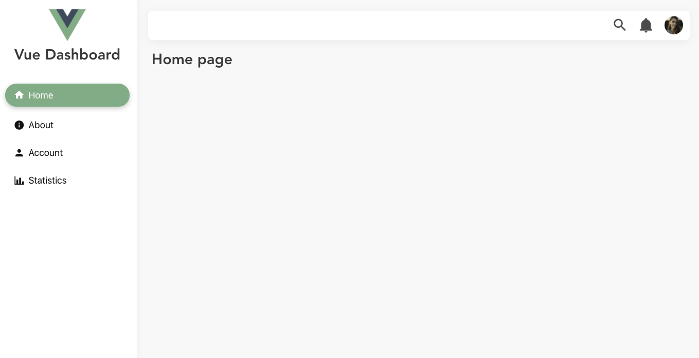

# Vue Dashboard


A simple, lightweight and responsive layout for your next Vue.js dashboard



## Quick start

### 1- Install
``` bash
# yarn
yarn add vue-dashboard-vd
```
``` bash
# npm
npm install vue-dashboard-vd
```
### 2- Import
``` javascript
import Vue from 'vue';
import VueDashboard from 'vue-dashboard-vd';

Vue.use(VueDashboard);
```

## Usage

**App.vue**
``` html
<template>
  <div id="app">
    <VdDashboard
      pageBackground="#f8f8f8"
      sidebarHeaderHeight="175px"
      sidebarWidth="300px"
      headerBackground="white"
      sidebarBackground="white"
    >
      <template v-slot:main-content>
        <router-view />
      </template>
      <template v-slot:header-content>
        <HeaderItems></HeaderItems>
      </template>
      <template v-slot:sidebar-header>
        <SidebarHeader></SidebarHeader>
      </template>
      <template v-slot:sidebar-content>
        <SidebarItems></SidebarItems>
      </template>
    </VdDashboard>
  </div>
</template>
```
`HeaderItems`, `SidebarHeader` and `SidebarItems` are not provided by the library.

Examples for these components can be found [here](https://github.com/SebastienBtr/vue-dashboard/blob/master/examples/vue2-example/src/components).  
It uses [Bulma](https://bulma.io/) as a css framework.

Complete examples can be found in `examples` folder.

## Found this project useful? ❤️
If you found this project useful, then please consider giving it a [⭐️ on Github](https://github.com/SebastienBtr/vue-dashboard) and sharing it with your friends via social media.

## Issues and feedback 💭
If you have any suggestion for including a feature or if something doesn't work, feel free to open a Github [issue](https://github.com/SebastienBtr/vue-dashboard/issues) for us to have a discussion on it.
